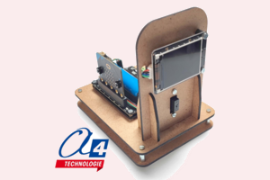

# a4_ms-stationnement

Extension MakeCode pour une maquette de borne de stationnement limitée (ms-stationnement).



## Présentation

Cette extension permet de piloter une maquette de borne de stationnement limitée.

Elle regroupe des blocs simples pour :
- gérer le système de la carte DFR1216,
- lire les capteurs de la maquette,
- piloter l'écran DFR.

## Blocs disponibles

### Système
- **niveau de batterie (%)**
- **mettre RGB en couleur**
- **mettre RGB en R G B**
- **régler luminosité RGB**
- **éteindre les LED RGB**

### Capteurs
- **présence d'un véhicule**
- **niveau d'intensité lumineuse**

### Écran
- **écran initialiser en I2C**
- **écran effacer tout**
- **écran définir couleur de fond**
- **couleur RVB**
- **écran définir image de fond**
- **écran afficher texte**
- **heure**
- **écran afficher image**
- **écran rotation image**
- **écran supprimer**

## Matériel
- carte **DFR1216**
- carte **micro:bit**
- écran **DFR compatible**
- capteur de proximité raccordé sur **C0**

## Exemple

```typescript
basic.showNumber(a4_ms_stationnement.niveauBatterie())
a4_ms_stationnement.ecranInitialiserI2C()
a4_ms_stationnement.ecranCouleurFond(
    a4_ms_stationnement.ecranCouleurRVB(239, 239, 239)
)

basic.forever(function () {
    if (a4_ms_stationnement.presenceVehicule()) {
        a4_ms_stationnement.setRGBColor(RGBIndex.Both, RGBColor.Red)
        a4_ms_stationnement.ecranAfficherTexte(
            "OCCUPE",
            1,
            120,
            120,
            a4_ms_stationnement.TaillePolice.Large,
            0xff0000
        )
    } else {
        a4_ms_stationnement.setRGBColor(RGBIndex.Both, RGBColor.Green)
        a4_ms_stationnement.ecranAfficherTexte(
            "LIBRE",
            1,
            120,
            120,
            a4_ms_stationnement.TaillePolice.Large,
            a4_ms_stationnement.ecranCouleurRVB(31, 160, 85)
        )
    }
})

## Licence

Ce projet est distribué sous licence **MIT**.

## Supported targets

* for PXT/microbit
